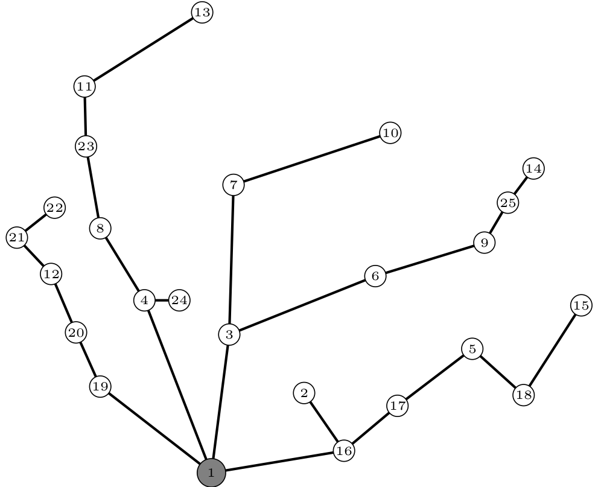

# Robust Optimal Planning of Power Distribution Networks Under Uncertain Load Conditions

We use a two-level robust optimization model for optimal planning of radial distribution networks where the power demand is highly uncertain. The robust optimization method is based on the column and constraint generation strategy. The optimization goal is to find the routes that provide minimal total annual costs that satisfy energy quality and technical limits, even in case of the worst uncertain power demand realization. The method incorporates the annual capital recovery, energy loss and undelivered energy costs. The column and constraint generation strategy was developed upon a mixed integer quadratically constraint programming model that is capable of obtaining a deterministic solution of the analyzed optimal feeder routing.

Details are given in  `presentation.pdf`.

|      |
| :----------------------------------------------------------: |
| Fig. 1. Possible routes in a distribution network (`case24.py`) |

|  |
| :----------------------------------------------------------: |
| Fig. 2. Optimal Solution for the Deterministic Model 4 lines from the supply bus, Objective: 68,934.98 $ |

|  |
| :----------------------------------------------------------: |
| Fig. 3. Optimal Solution for the Robust Model 5 lines from the supply bus, Objective: 91,712.55 $, Increase: 33% |
